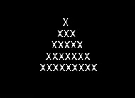
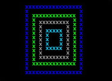
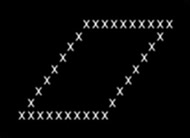
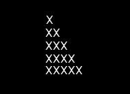

# pascal-for-newbies

My old pascal programs from high school. I saved just few of them. It is strange how
many programs disappear so easy. I hope this repository will help someone to learn as it helped me to start
to develop and understand very basics of programming.

In this repository you can find 35 basic pascal programs.

## 1. - 2. usa.pas

[usa source code in multiple layers](flags/usa_in_multiple_layers.pas) in multiple layers overlapping

[usa source code in one layer](flags/usa_in_one_layer.pas) in one layer overlapping

## 3. burundi.pas

[burundi source code](flags/burundi.pas)

## 4. - 5. north_korea.pas

[north korea source code](flags/north_korea_in_one_layer.pas) in one layer not overlapping

[north korea source code](flags/north_korea_in_multiple_layers.pas) in multiple layers overlapping

## 6. - 7. south_korea.pas

[south korea source code](flags/south_korea.pas)

## 8. - 9. france.pas

[france source code in multiple layers](flags/france_in_multiple_layers.pas) version in multiple layers overlapping

[france source code in one layer](flags/france_in_one_layer.pas) version in one layer not overlapping

## 10. - 11. algeria.pas

[algeria source code in one layer](flags/algeria_in_one_layer.pas) in one layer not overlapping

[algeria source code in multiple layers](flags/algeria_in_multiple_layers.pas) in multiple layers overlapping

## 12. - 13. britain.pas

[britain source code in multiple layers](flags/britain_in_multiple_layers.pas) in multiple layers overlapping

[britain source code in one layer](flags/britain_in_one_layer.pas) in one layer not overlapping

## 14. yin_yang.pas

[yin_yang source](x-pictures/yin_yang.pas)

## 15. sand_glass.pas

[sand_glass source](x-pictures/sand_glass.pas)

## 16. circle.pas

[circle source](x-pictures/circle.pas)

## 17. triangle.pas

[triangle source](x-pictures/triangle.pas)

## 18. - 19. triangle_full.pas

[triangle_full source](x-pictures/triangle_full.pas) until - repeat version

[triangle_full_2 source](x-pictures/triangle_full_2.pas)

## 20. square in square.pas

[square in square source](x-pictures/square_in_square.pas)

## 21. empty_rhombus.pas

[empty_rhombus source](x-pictures/empty_rhombus.pas)

## 22. full_rhombus.pas

[full_rhombus source](x-pictures/full_rhombus.pas)

## 23. right_triangle.pas

[right_triangle source](x-pictures/right_triangle.pas)

## 24. right_angled_triangle.pas

[right_angled_triangle source](x-pictures/right_angled_triangle.pas)

## 25. volume-surface.pas

[volume-surface.pas](volume-surface/volume_surface.pas)

The program calculates the volume and surface of the following : cube, block, sphere, 
rotating cone, rotating cylinder. The program gives you the opportunity to choose 
for which shape it will be calculated.

## 26. del17.pas

[del17.pas](del/del17.pas)

Program read user input number and find out if the number is divisible with 17.

## 27. deln.pas

[deln.pas](del/deln.pas)

Program read user input number and find out if the number is divisible with user input number.

## 28. max.pas

[max.pas](find-max/max.pas)

Try to find maximum from 3 input numbers.

## 29. hello_world.pas

[hello_world.pas](hello-world/hello_world.pas)

Hello world app

## 30. interval.pas

[interval.pas](interval/interval.pas)

The program prints all numbers from the interval, the limit of which is entered by the user.

## 31. interval_ext.pas

[interval_ext.pas](interval/interval_ext.pas)

Extending the program to list all numbers with properties
which is entered by the user from an interval also entered by the user. These are: the divisor 
of all the numbers in the interval, the remainder after dividing all the numbers in the interval.

## 32. search_20.pas

[search_20.pas](search-num/search_20.pas)

The program reads 6 arbitrary numbers and finds out if there is a number 20 between them.

## 33. search_num.pas

[search_num.pas](search-num/search_num.pas)

We extend the program to search for a number specified by the user.

## 34. radian_values_of_sinus_from_interval.pas

[radian_values_of_sinus_from_interval.pas](sinus-in-radians/radian_values_of_sinus_from_interval.pas)

The program reads the user-specified interval in radians, converts it, and prints the sine values in increments π/36.

## 35. volume_surface.pas

[volume_surface.pas](volume-surface/volume_surface.pas)

The program calculates the volume and surface of the following : cube, block, sphere, 
rotating cone, rotating cylinder. The program gives you the opportunity to choose for
 which shape it will be calculated.
