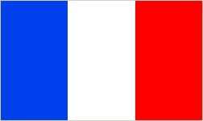
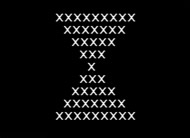
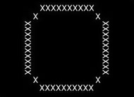
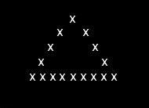
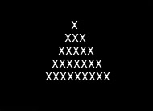
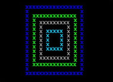
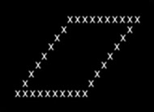
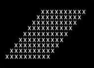
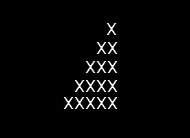
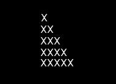

# pascal-for-newbies

My old pascal programs from high school. I saved just few of them. It is strange how
many programs disappear so easy. I hope this repository will help someone to learn as it helped me to start
to develop and understand very basics of programming.

## usa.pas

[usa source code in multiple layers](flags/usa_in_multiple_layers.pas) in multiple layers overlapping

[usa source code in one layer](flags/usa_in_one_layer.pas) in one layer overlapping

## burundi.pas

[burundi source code](flags/burundi.pas)

## north_korea.pas

[north korea source code](flags/north_korea_in_one_layer.pas) in one layer not overlapping

[north korea source code](flags/north_korea_in_multiple_layers.pas) in multiple layers overlapping

## south_korea.pas

[south korea source code](flags/south_korea.pas)

## france.pas

[france source code in multiple layers](flags/france_in_multiple_layers.pas) version in multiple layers overlapping

[france source code in one layer](flags/france_in_one_layer.pas) version in one layer not overlapping

## algeria.pas

[algeria source code in one layer](flags/algeria_in_one_layer.pas) in one layer not overlapping

[algeria source code in multiple layers](flags/algeria_in_multiple_layers.pas) in multiple layers overlapping

## britain.pas

[britain source code in multiple layers](flags/britain_in_multiple_layers.pas) in multiple layers overlapping

[britain source code in one layer](flags/britain_in_one_layer.pas) in one layer not overlapping

## yin-yang.pas

[yin-yang source](x-pictures/yin_yang.pas)

## sand_glass.pas

[sand_glass source](x-pictures/sand_glass.pas)

## circle.pas

[circle source](x-pictures/circle.pas)

## triangle.pas

[triangle source](x-pictures/triangle.pas)

## triangle-full.pas

[triangle-full source](x-pictures/triangle-full.pas) until - repeat version

[triangle-full-2 source](x-pictures/triangle-full-2.pas)

## sustredne_stvorce.pas

[sustredne_stvorce source](x-pictures/sustredne_stvorce.pas)

## prazdny_kosostvorec.pas

[prazdny_kosostvorec source](x-pictures/prazdny_kosostvorec.pas)

## plny_kosostvorec.pas

[plny_kosostvorec source](x-pictures/full_rhombus.pas)

## pravo1.pas

[pravo1 source](x-pictures/right_triangle.pas)

## pravo2.pas

[pravo2 source](x-pictures/pravo2.pas)

## volume-surface.pas

[volume-surface.pas](volume-surface/volume_surface.pas)

The program calculates the volume and surface of the following : cube, block, sphere, 
rotating cone, rotating cylinder. The program gives you the opportunity to choose 
for which shape it will be calculated.

## del17.pas

[del17.pas](del/del17.pas)

Program read user input number and find out if the number is divisible with 17.

## deln.pas

[deln.pas](del/deln.pas)

Program read user input number and find out if the number is divisible with user input number.

## max.pas

[max.pas](find-max/max.pas)

Try to find maximum from 3 input numbers.

## hello_world.pas

[hello_world.pas](hello-world/hello_world.pas)

Hello world app

## interval.pas

[interval.pas](interval/interval.pas)

The program prints all numbers from the interval, the limit of which is entered by the user.

## interval_ext.pas

[interval_ext.pas](interval/interval_ext.pas)

Extending the program to list all numbers with properties
which is entered by the user from an interval also entered by the user. These are: the divisor 
of all the numbers in the interval, the remainder after dividing all the numbers in the interval.

## interval.pas

[interval.pas](interval/interval.pas)

The program prints all numbers from the interval, the limit of which is entered by the user.

## interval_ext.pas

[interval_ext.pas](interval/interval_ext.pas)

Extending the program to list all numbers with properties
which is entered by the user from an interval also entered by the user. 
These are: the divisor of all the numbers in the interval, the remainder after 
dividing all the numbers in the interval.

## search_20.pas

[search_20.pas](search-num/search_20.pas)

The program reads 6 arbitrary numbers and finds out if there is a number 20 between them.

## search_num.pas

[search_num.pas](search-num/search_num.pas)

We extend the program to search for a number specified by the user.

## radian_values_of_sinus_from_interval.pas

[radian_values_of_sinus_from_interval.pas](sinus-in-radians/radian_values_of_sinus_from_interval.pas)

The program reads the user-specified interval in radians, converts it, and prints the sine values in increments π/36.

## volume_surface.pas

[volume_surface.pas](volume-surface/volume_surface.pas)

The program calculates the volume and surface of the following : cube, block, sphere, 
rotating cone, rotating cylinder. The program gives you the opportunity to choose for
 which shape it will be calculated.
