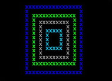

## yin_yang.pas

[yin_yang source](yin_yang.pas)

## sand_glass.pas

[sand_glass source](sand_glass.pas)

## circle.pas

[circle source](circle.pas)

## triangle.pas

[triangle source](triangle.pas)

## triangle_full.pas

[triangle_full source](triangle_full.pas) until - repeat version

[triangle_full_2 source](triangle_full_2.pas)

## square in square.pas

[square in square source](square_in_square.pas)

## empty_rhombus.pas

[empty_rhombus source](empty_rhombus.pas)

## full_rhombus.pas

[full_rhombus source](full_rhombus.pas)

## right_triangle.pas

[right_triangle source](right_triangle.pas)

## right_angled_triangle.pas

[right_angled_triangle source](right_angled_triangle.pas)

