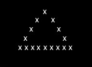
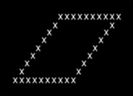

## yin_yang.pas

[yin_yang source](yin_yang.pas)

## sand_glass.pas

[sand_glass source](sand_glass.pas)

## circle.pas

[circle source](circle.pas)

## triangle.pas

[triangle source](triangle.pas)

## triangle-full.pas

[triangle-full source](triangle-full.pas) until - repeat version

[triangle-full-2 source](triangle-full-2.pas)

## sustredne_stvorce.pas

[sustredne_stvorce source](sustredne_stvorce.pas)

## empty_rhombus.pas

[empty_rhombus source](empty_rhombus.pas)

## full_rhombus.pas

[full_rhombus source](full_rhombus.pas)

## right_triangle.pas

[right_triangle source](right_triangle.pas)

## right_angled_triangle.pas

[right_angled_triangle source](right_angled_triangle.pas)

